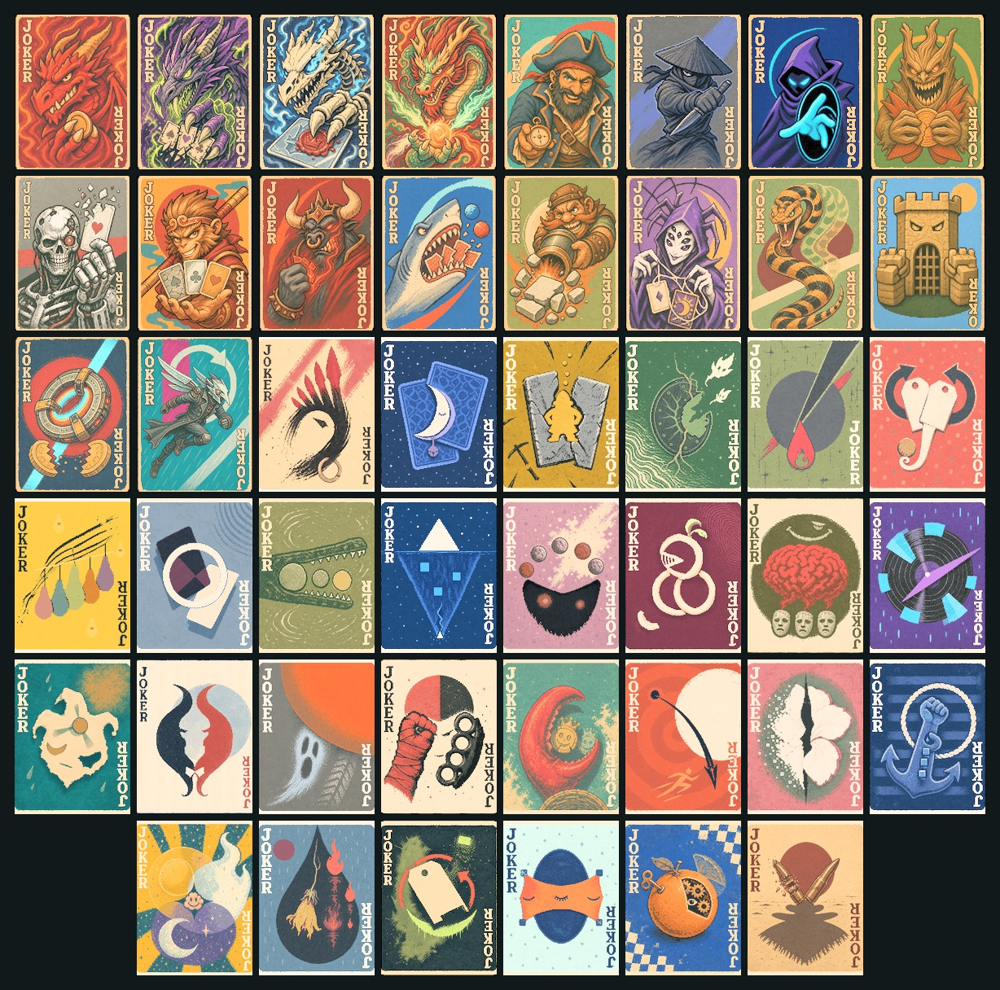
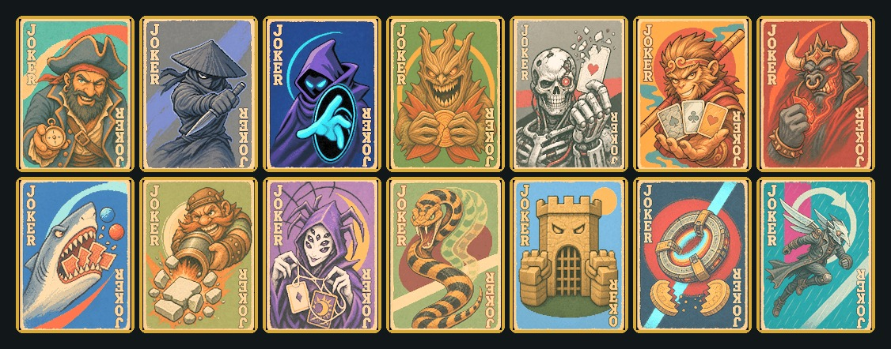

# 龙与奇幻城：命运铸牌

## Dragon Fantasy City: Forged by Fate

> **每一张小丑牌都在改写一条规则；每一局，都是一座被命运重新建造的城。**<br>
> **Every Joker rewrites a rule. Every run rebuilds the city.**



[](https://github.com/minimal553/DragonFantasyCity-Balatro/releases)
[](docs/CARD_GUIDE.en.md)
[](#安装--installation)
[](https://github.com/minimal553/DragonFantasyCity-Balatro/actions/workflows/validate.yml)

**《龙与奇幻城》不是一包“换皮加数值”的牌。** 它加入 46 张拥有独立机制与美术表达的小丑牌：用消费喂养史矛革，用毁牌唤醒黑毒龙，让新牌、重触发、商店经济与手牌结构彼此咬合。你可以搭出稳定引擎，也可以押上一切，让一局牌在几回合内变成失控的奇幻机器。

**Dragon Fantasy City is not a reskin pack.** Its 46 original Jokers create interlocking engines around spending, destruction, retriggers, card generation, shop economy, and hand sculpting. Build a disciplined machine—or gamble on a combo that turns the run into glorious chaos.

## 为什么值得玩 / Why play it?

- **46 张原创小丑牌**：4 传奇、14 稀有、28 罕见，不用重复模板填数量。
- **真正能围绕它们构筑**：龙族负责成长型引擎，稀有牌改变整局方向，罕见牌负责拼出组合零件。
- **众生平等牌组**：开局获得一张“灵魂”；商店稀有度为普通 60%、罕见 24%、稀有 13%、传奇 3%，第三个盲注起基础出牌与弃牌各 -1。
- **统一的奇幻像素牌面**：传奇牌强调角色冲击，稀有牌强调叙事场景，罕见牌用更简洁的符号表达机制。
- **简体中文优先**：当前游戏内名称、说明与动态数值均为简体中文；仓库文档同时提供中英文版本。

- **46 original Jokers**: 4 Legendary, 14 Rare, and 28 Uncommon—each with its own gameplay identity.
- **Build-around mechanics**: dragons become long-term engines, Rares redirect a run, and Uncommons connect the combo pieces.
- **Equal Fortune Deck**: starts with The Soul; shop rarity weights are 60% Common, 24% Uncommon, 13% Rare, and 3% Legendary. From Blind 3 onward, base hands and discards are reduced by one.
- **A coherent visual hierarchy**: character-driven Legendary cards, narrative Rare cards, and symbolic Uncommon cards.
- **Chinese-first in game**: the current in-game localization is Simplified Chinese; full Chinese and English documentation is included here.

## 一眼看懂这座城 / Meet the city

### 传奇：能定义整局的四条龙 / Legendary run-defining dragons


- **红龙史矛革**把每一笔花费都炼成永久倍率。
- **黑毒龙阿萨比斯**把毁牌数量炼成全体计分牌的永久重触发。
- **骷髅龙骨恩**每次出牌都把一张红蜡封钢铁 K 送入当前手牌，并能联动“新增牌”效果。
- **中华龙**从其他非普通小丑的有效触发中不断成长。

### 稀有：改变路线的强规则 / Rare rule-benders



探索牌型、永久负片、随机强化、毁牌换星球、顺子多重触发、累积长城、双倍盲注与双倍资金……这些牌不是单纯“加筹码”，而是在要求你重新安排整局的节奏。

### 罕见：组合真正开始的地方 / Uncommon combo pieces


28 张罕见牌覆盖弃牌、商店、留手、点数差、花色、消耗牌、新增牌和最后一手等触发窗口。单张容易理解，组合起来却能产生完全不同的构筑路径。

完整图鉴与设计解读：

- [中文：46 张卡牌效果与设计思路](docs/CARD_GUIDE.zh-CN.md)
- [English: Complete 46-card guide and design notes](docs/CARD_GUIDE.en.md)
- [整体系统、美术层级与平衡哲学](docs/DESIGN_NOTES.md)

## 安装 / Installation

### 下载发行版（推荐）/ Download a release (recommended)

1. 从 [Releases](https://github.com/minimal553/DragonFantasyCity-Balatro/releases) 下载最新的 `DragonFantasyCity-v0.1.3.zip`。
2. 解压后，将其中的 `DragonFantasyCity` 文件夹复制到 `%APPDATA%\Balatro\Mods\`。
3. 确认目录为 `%APPDATA%\Balatro\Mods\DragonFantasyCity\DragonFantasyCity.lua`，然后重启游戏。

1. Download `DragonFantasyCity-v0.1.3.zip` from [Releases](https://github.com/minimal553/DragonFantasyCity-Balatro/releases).
2. Extract the `DragonFantasyCity` folder into `%APPDATA%\Balatro\Mods\`.
3. Verify that `%APPDATA%\Balatro\Mods\DragonFantasyCity\DragonFantasyCity.lua` exists, then restart Balatro.

### 前置依赖 / Requirements

- Balatro（Steam 版）
- [Lovely Injector](https://github.com/ethangreen-dev/lovely-injector) 0.9.0 或兼容版本
- [Steamodded](https://github.com/Steamodded/smods) `>= 1.0.0~BETA-1814a`

当前版本在 Windows、Lovely 0.9.0 与 Steamodded 26.829.0 环境完成启动与注册验证。与大型内容包同时使用时，建议逐个启用并查看最新 Lovely 日志。

The current build has passed startup and registration checks on Windows with Lovely 0.9.0 and Steamodded 26.829.0. When combining it with large content packs, enable mods incrementally and inspect the newest Lovely log.

## 当前状态 / Project status

`v0.1.3` 是**可运行公开测试版**：46 张牌、众生平等牌组、1x/2x 图集与中文文本均已注册并通过结构测试及启动日志检查。它仍需要更多不同组合下的长局实测；如果遇到机制冲突或软锁，请使用 [Bug report](https://github.com/minimal553/DragonFantasyCity-Balatro/issues/new?template=bug_report.yml) 并附上 Lovely 日志。

`v0.1.3` is a **playable public test build**. All 46 Jokers, the Equal Fortune Deck, 1x/2x atlases, and Chinese text pass structural tests and startup-log validation. More long-run compatibility testing is still welcome; please attach your Lovely log when reporting a conflict or softlock.

## 开发与验证 / Development

- `mod/DragonFantasyCity/`：可直接安装的 MOD。
- `mod/DragonFantasyCity/assets/`：经过校色并随 MOD 发布的完整 1x/2x 图集。
- `tools/build_showcase.py`：重建 README 展示图。
- `tests/test_mod_structure.py`：验证卡牌数量、点数规则、资源尺寸、关键修复与平衡参数。

```powershell
python tools/build_showcase.py
python tests/test_mod_structure.py
```

## 重要规则 / Important rules

- J / Q / K 的点数均为 **10**，A 为 **11**。
- 疯狂树魔不会重触发自身或同名牌，避免无限递归。
- 蜘蛛女巫每次出牌至多生成一张塔罗牌。
- 银翼杀手通过把补充包设为免费、再由玩家正常点击打开，避免跳过游戏状态机造成软锁。

## 反馈 / Feedback

如果某张牌让你打出了离谱但漂亮的组合，欢迎晒出来；如果它只是离谱而不漂亮，也请告诉我。平衡反馈最好包含底注、牌组、所持小丑、触发顺序与日志。

If a Joker creates a ridiculous *and* beautiful combo, show it off. If it is only ridiculous, tell me that too. The most useful balance reports include Ante, deck, owned Jokers, trigger order, and the Lovely log.

> Balatro belongs to LocalThunk/Playstack. This is an unofficial fan-made mod and is not affiliated with or endorsed by the original developers or publisher.

